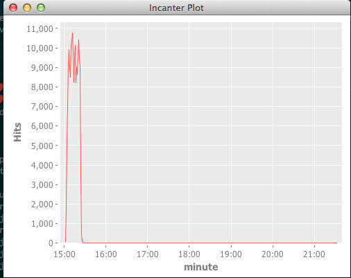

# lumberjack

A Clojure library designed to help with your log lines.  Currently creates a log entry structure for Nginx logs, and allows for some basic visualization of time series data.

## Dependencies 


* [Clojure](http://clojure.org/)
* [clj-time](https://github.com/seancorfield/clj-time)
* [Incanter](http://incanter.org/)

### Dev Dependencies

* [midje](https://github.com/marick/Midje) - Unit tests


## Artifacts

Lumberjack artifacts are [released to Clojars](https://clojars.org/lumberjack). If you are using Maven, add the following repository
definition to your `pom.xml`:

``` xml
<repository>
  <id>clojars.org</id>
  <url>http://clojars.org/repo</url>
</repository>
```

### The Most Recent Release

With Leiningen:

``` clj
[lumberjack "0.1.0"]
```

With Maven:

``` xml
<dependency>
  <groupId>lumberjack</groupId>
  <artifactId>lumberjack</artifactId>
  <version>0.1.0</version>
</dependency>
```

## Usage

To view a simple time series graph of the number of hits by the minute:

``` clj
=> (use 'lumberjack.core)
=> (use 'lumberjack.nginx)
=> (use 'lumberjack.visualization)
``` 

``` clj
(view-time-series (nginx-logs [path-to-nginx-log file]) :by timestamp-minute :grouping-name "minute")
``` 

Doing the above will give you a graph that looks like the following.



For very large log files you may need to update the project.clj file to
include a setting for the allowed memory size via:

``` clj
 :jvm-opts ["-Xmx768M"]
```

and adjust the 768M to an appropriate number of megabytes.

## License

Copyright © 2013 Steven Proctor

Distributed under the Eclipse Public License, the same as Clojure.
